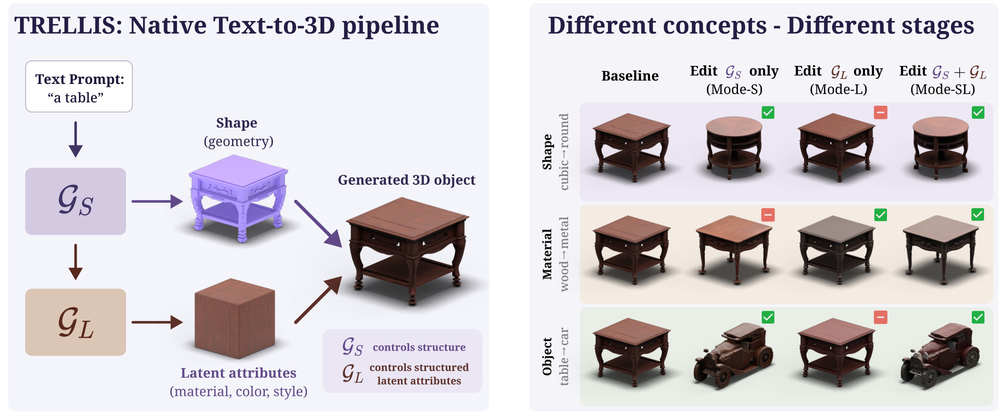
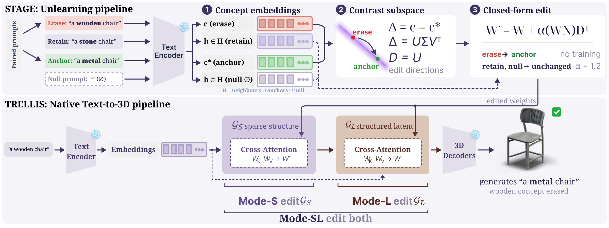

<div align="center">

# STAGE: Subspace-Targeted Affine Generative Erasure for Text-to-3D Models

[Karol Dziekan](https://www.linkedin.com/in/karol-dziekan/)<sup>1</sup>, [Przemysław Spurek](https://scholar.google.com/citations?hl=en&user=0kp0MbgAAAAJ)<sup>1,2</sup>, [Dawid Malarz](https://www.linkedin.com/in/dawid-malarz/)<sup>1,2</sup>

<sup>1</sup> Jagiellonian University &nbsp;&nbsp; <sup>2</sup> IDEAS Research Institute

<a href="https://arxiv.org/abs/2610.01302"></a> <a href="https://gmum.github.io/STAGE/"></a>

</div>



## Abstract

Concept erasure suppresses a target concept while preserving behavior on unrelated inputs.
Existing closed-form methods were designed for 2D image diffusion and assume a single
generative pathway, so one edit must cover geometry and texture at once. Native 3D generators,
which synthesize structured 3D representations directly rather than by lifting 2D samples,
violate this assumption. We show that shape and object concepts must be erased in the
structural stage of the pipeline and material concepts in the appearance stage. We therefore
formulate erasure in native text-to-3D as a stage-aware editing problem and introduce
**STAGE (Subspace-Targeted Affine Generative Erasure)**, a training-free, closed-form
framework. STAGE confines each edit to the low-dimensional subspace spanned by the differences
between erase and anchor embeddings, and relaxes the norm-preserving (orthogonal) constraint of
prior editors into a least-squares affine correction that maps target activations onto safe
anchors subject to a penalty on the displacement of retained prompts. The correction applies to
the structural stage, the appearance stage, or both. We find that the stage an edit must reach
is determined by concept type. On TRELLIS, the standard open native 3D generator, across 15
shape, material, and object concepts, STAGE reaches 66.7 on a composite score that balances
forgetting the target concept against preserving everything else, aggregating CLIP-based
semantic and physical metrics, versus 53.2 for the strongest adapted baseline.



## Results

3D Unlearning Score on 15 concepts of TRELLIS, five per axis. F measures forgetting of the
erased concept, P preservation of all other concepts, and 3D-US combines both. All methods edit
the same stages. Higher is better, best values in bold.

<table>
  <thead>
    <tr>
      <th rowspan="2">Method</th>
      <th colspan="3">Shape</th>
      <th colspan="3">Material</th>
      <th colspan="3">Object</th>
      <th>Overall</th>
    </tr>
    <tr>
      <th>F</th><th>P</th><th>3D-US</th>
      <th>F</th><th>P</th><th>3D-US</th>
      <th>F</th><th>P</th><th>3D-US</th>
      <th>3D-US</th>
    </tr>
  </thead>
  <tbody>
    <tr>
      <td>UCE</td>
      <td>0.61</td><td>0.85</td><td>66.9</td>
      <td>0.22</td><td>0.84</td><td>30.8</td>
      <td>0.57</td><td><b>0.65</b></td><td>51.9</td>
      <td>47.5</td>
    </tr>
    <tr>
      <td>OCE</td>
      <td><b>0.73</b></td><td>0.67</td><td>67.9</td>
      <td>0.36</td><td>0.74</td><td>41.8</td>
      <td>0.83</td><td>0.41</td><td>53.2</td>
      <td>53.2</td>
    </tr>
    <tr>
      <td><b>STAGE</b></td>
      <td>0.70</td><td><b>0.91</b></td><td><b>77.7</b></td>
      <td><b>0.45</b></td><td><b>0.92</b></td><td><b>56.4</b></td>
      <td><b>0.90</b></td><td>0.61</td><td><b>67.7</b></td>
      <td><b>66.7</b></td>
    </tr>
  </tbody>
</table>

<div align="center">

### [→ Setup and usage ←](SETUP.md)

</div>

## Citation

If you find this work useful, please cite our paper:

```bibtex
@article{dziekan2026stage,
  title   = {{STAGE}: Subspace-Targeted Affine Generative Erasure for Text-to-3D Models},
  author  = {Dziekan, Karol and Spurek, Przemys{\l}aw and Malarz, Dawid},
  journal = {arXiv preprint arXiv:2610.01302},
  year    = {2026}
}
```

## License

This code is released under the MIT license. `trellis/` and `metrics/uni3d_model/` contain code
from [TRELLIS](https://github.com/microsoft/TRELLIS) and [Uni3D](https://github.com/baaivision/Uni3D),
both released under the MIT license.
